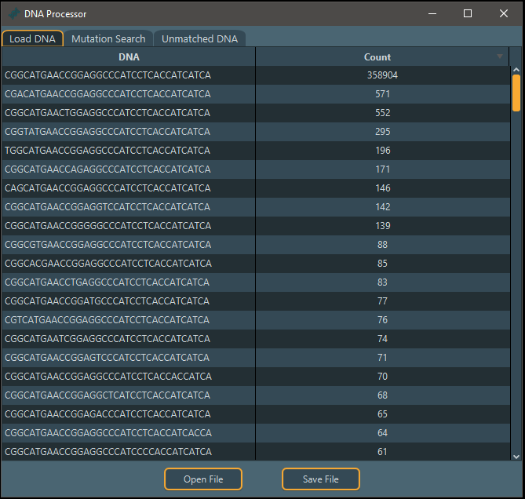
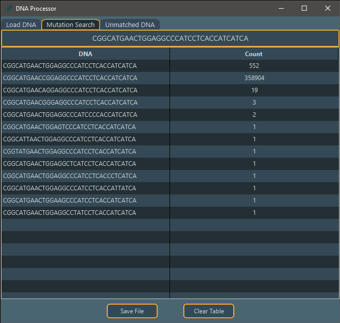
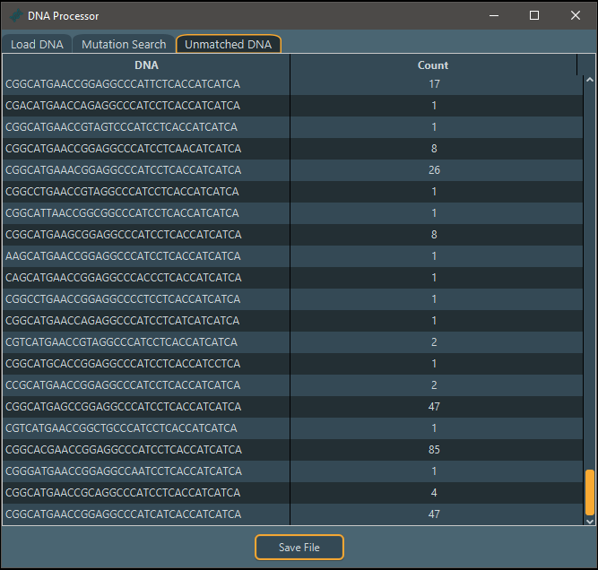

<h1>DNA Processor</h1>
<body>

This is a program that can count and search for single nucleotide mutations from a set of DNA Sequences. It allows for the import of text files containing the DNA sequences and populates a table where only the unique instances will be kept and counted.
In the mutations tab you can search for single nucleotide mutations.

Afterwards the sets can be exported in csv format. 

<h1>Build</h1>

Under builds you can find the executables or jar files. The executable isnt signed so it might throw a warning on windows. If you're worried about the safety of the program then feel free to just build the project yourself.

If you want to build it yourself then make sure you have Eclipse, JavaFX, and Scene Builder.

<h1>How to use</h1>

Make sure all of the DNA is seperated on new lines. The program splits the text file based off new line characters. Afterwards it should automatically populate the table with each unique instance and count it.

For the mutations tab you need the previous table to be populated. You can copy one of the DNA's from the previous table and paste it in the search bar to populate the table with all the single nucleotide mutations for that specific DNA.

<h1>Unique Instance Tab</h1>

The inque instance tab will count all the unqieue instances of a DNA sequence and count them. You can use any of the column headers to sort the data.

<h1>Mutations Tab</h1>

The mutations tab requires that a data set has been loaded. Once thats been done you can search a DNA Sequence. The mutations tab will only search for single nucleotide mutations(i.e if one character differs between the two strings.)

<h1>Unmatched Tab</h1>

After searching in the mutations tab any DNA that wasnt matched gets displayed here.

Each one of the tabs can have their information exported in CSV format.

</body>

<h1>Known Issues</h1>

Currently you can run into issues if the DNA sequences differ in length.

